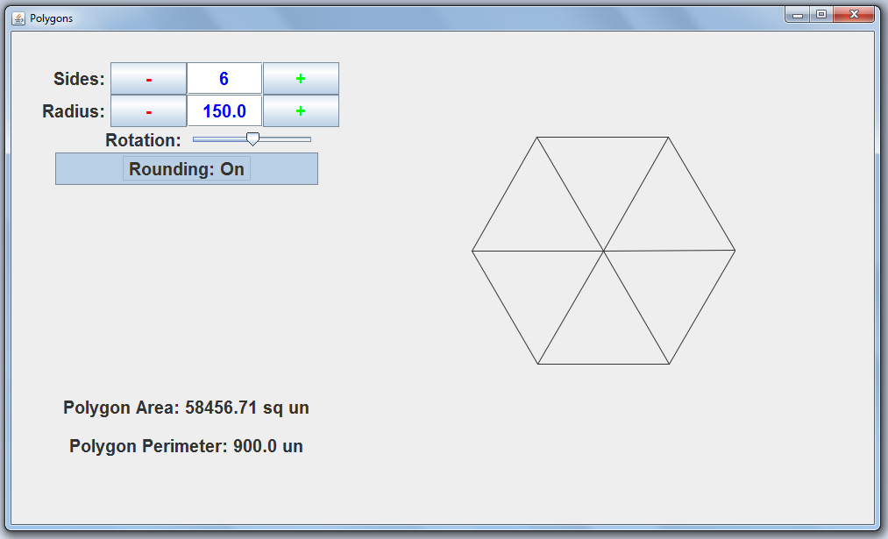

# RegularPolygons

This Geometry teaching applet to visually represents a regular n-sided polygon by taking an input of the sides and radius. It outputs the visual of the polygon, the area, and the perimeter.

